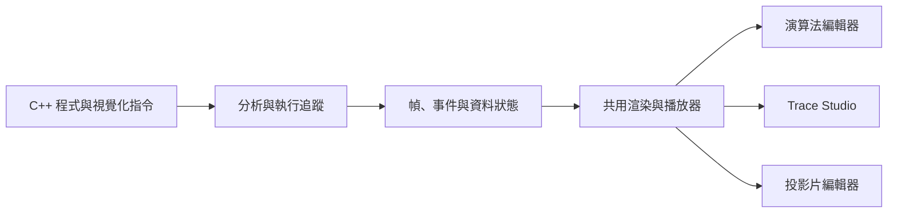

# AlgoShowMaker

AlgoShowMaker 是一套演算法教學與簡報製作工具。你可以在 C++ 程式碼中加入少量視覺化指令，執行後產生可播放、可編輯的動畫，再把動畫、文字、LaTeX、程式碼與資料結構排成教學投影片。

- 介面語言：繁體中文
- 穩定版本：AV_V4.10
- 專案首頁：[GitHub](https://github.com/bamboo20030309/AlgoShowMaker)

## 核心功能

- 追蹤 C++ 程式執行，將變數與資料結構轉成動畫。
- 支援陣列、圖、樹、堆積、線段樹、Binary Indexed Tree 等結構。
- 使用 `@frame`、`@style`、`@move` 等指令控制畫面與事件。
- 在 Trace Studio 檢查執行步驟、事件與資料變化。
- 在投影片編輯器混合動畫、文字、LaTeX、程式碼、圖片與形狀。
- 提供範例演算法投影片，可直接開啟、學習與修改。
- 支援專案儲存、分享、匯入與匯出。

## 主要介面

| 介面 | 用途 |
| --- | --- |
| 工作區 | 管理程式碼、動畫與投影片專案 |
| 演算法編輯器 | 撰寫 C++、執行追蹤並預覽動畫 |
| Trace Studio | 檢查幀、事件、變數與資料結構 |
| 投影片編輯器 | 編排教學內容與嵌入演算法動畫 |
| 範例投影片 | 瀏覽並套用既有教學投影片 |

## 快速啟動

需求：

- Node.js 18 以上
- MongoDB
- 可編譯 C++17 的編譯器

```bash
cd algo-vis-backend
npm install
```

在 `algo-vis-backend/.env` 建立環境設定：

```env
PORT=3000
MONGO_URI=mongodb://127.0.0.1:27017/algoshowmaker
JWT_SECRET=replace-with-a-random-secret
```

啟動服務：

```bash
cd algo-vis-backend
npm start
```

開啟 `http://localhost:3000`。若需要 Windows、Docker、MongoDB 或部署設定，請參考 [安裝與部署指南](SETUP_GUIDE.md)。

## 建立第一段動畫

在演算法編輯器貼上程式碼，加入視覺化指令後按下 **RUN**：

```cpp
#include <bits/stdc++.h>
using namespace std;

int main() {
    vector<int> a = {5, 2, 4, 1};
    // @frame a

    for (int i = 0; i < (int)a.size(); ++i) {
        for (int j = 0; j + 1 < (int)a.size() - i; ++j) {
            if (a[j] > a[j + 1]) {
                swap(a[j], a[j + 1]);
            }
            // @frame a[j,j+1]
            // @style a[j,j+1] highlight
        }
    }
}
```

常用指令包含 `@frame`、`@style`、`@text`、`@keep`、`@arrow` 與 `@camera`。完整語法、作用範圍與範例集中在 [演算法視覺化指令手冊](ALGORITHM_VISUALIZATION_DIRECTIVE_MANUAL.md)。

## 製作教學投影片

從工作區開啟投影片編輯器，即可新增一般投影片或演算法投影片。既有動畫可以直接嵌入頁面，LaTeX 與程式碼請使用對應元件，方便後續編輯、排版與相容性處理。

想從完成品開始，可先開啟首頁或工作區的「範例投影片」，再複製成自己的專案。

## 運作方式



編輯器、Trace Studio 與投影片使用同一套動畫資料與渲染流程，因此同一段演算法可以在不同介面中重複使用。各指令如何轉成事件、何時產生幀，以及播放排程的細節，請查閱指令手冊與程式碼。

## 專案結構

| 路徑 | 內容 |
| --- | --- |
| `algo-vis-backend/server.js` | Web 服務與主要 API |
| `algo-vis-backend/public/` | 編輯器、播放器與前端資源 |
| `algo-vis-backend/trace-instrumenter.js` | C++ 追蹤與解析 |
| `algo-vis-backend/algorithm_sample/` | 範例程式 |
| `algo-vis-backend/tests/` | 自動化測試 |

## 測試

```bash
cd algo-vis-backend
npm test
```

動畫回歸、分類方式與測試環境請參考 [測試說明](algo-vis-backend/tests/README.md)。

## 相關文件

- [演算法視覺化指令手冊](ALGORITHM_VISUALIZATION_DIRECTIVE_MANUAL.md)
- [安裝與部署指南](SETUP_GUIDE.md)
- [測試說明](algo-vis-backend/tests/README.md)

## 授權

本專案採用 [MIT License](LICENSE)。
