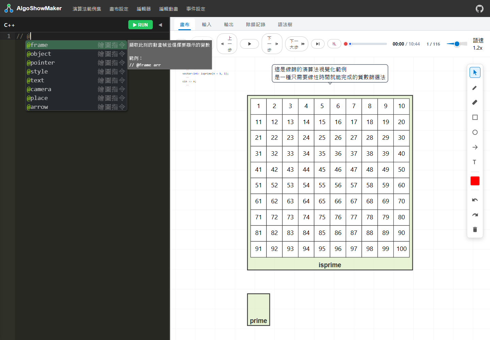
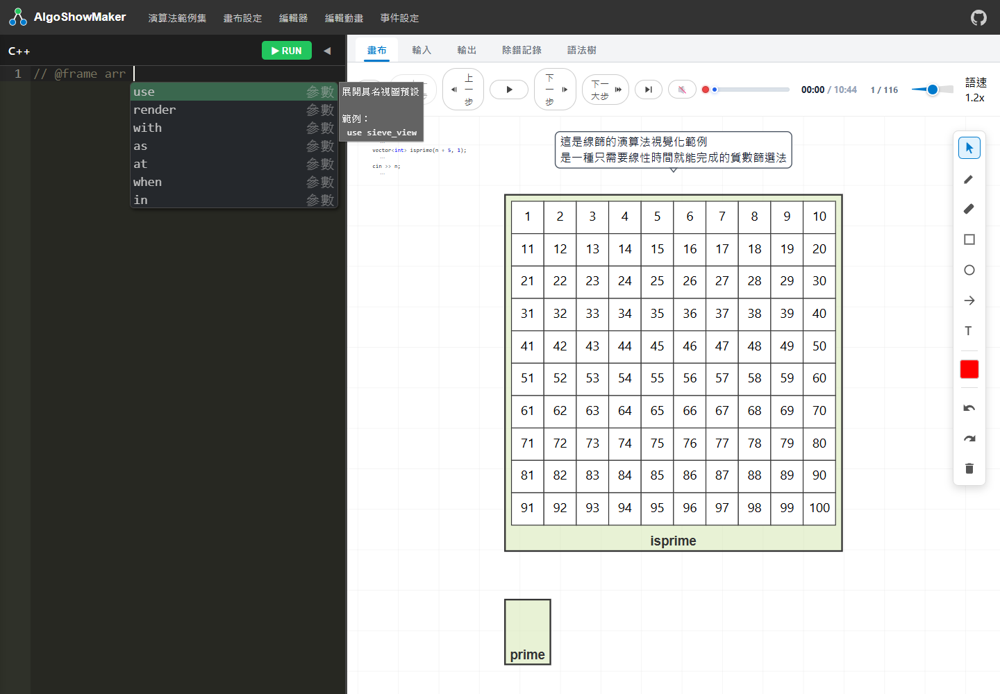

# AlgoShowMaker 繪圖指令速查與效果

這份文件給編寫教材的人閱讀。先選「這一行要做什麼」，再補目標、參數與位置；不是每個選項都要寫。完整語法、邊界與限制另見 [詳細手冊](../ALGORITHM_VISUALIZATION_DIRECTIVE_MANUAL.md)。

## 怎麼叫出清單

- 在空白行輸入 `@`，或在註解中輸入 `// @`，立即顯示起始指令。
- 起始清單只有 `@frame`、`@object` 等指令，不會混入 `with`、`at`。
- 用 ↑↓ 選取，Tab 或 Enter 插入；選定裸 `@` 的指令時，自動補成 C++ 註解 `// @...`。
- 指令後輸入目標，例如 `// @frame arr `，再列出這條指令能接的後綴。
- `with` 後列出 `range(...)`、`labels(...)` 等選項；`render` 後列出畫法。
- Esc 關閉；位於指令中且清單關閉時，Tab 可重新開啟。一般 C++ 的 Tab 保留縮排。
- 指令行按右鍵，仍可瀏覽並插入「最小／常用／完整」範例。

清單只負責協助輸入，沒有替代解析器檢查。變數、preset 名稱、條件及索引仍需依自己的程式填寫。範例中的 arr、i、dp、tree 是佔位名稱，不會自動宣告 C++ 變數。

### 起始清單的實際畫面



### 後綴清單的實際畫面



## 三個最重要的觀念

1. `@frame` 擷取程式執行到這裡的狀態，建立新幀。
2. `@object`、`@style`、`@text` 等指令附屬於上方最近的幀；每條仍各占一行、以 `// @` 開始。
3. `with`、`at`、`when` 等是同一行的後綴，不能當作新的 `@` 指令使用。不同指令支援的後綴不同，例如 `@style` 不能加 `at`，定位請用 `@place`。

```cpp
// @frame arr
// @pointer i at arr
// @style arr[0:i] focus
// @text "目前走到第 ${i} 格" at arr.bottom
```

這會顯示陣列與 i 指標，保留已走訪區段，淡化後方尚未走訪的格子。焦點、標記及指示樣式優先省略顏色，使用引擎預設；陣列遍歷優先使用指標，而非每一步重塗背景。

## 起始指令總覽

| 指令 | 用途 |
| --- | --- |
| `@frame` | 擷取此刻的動畫幀並選擇要顯示的變數 |
| `@object` | 在同一個 @frame 加入另一個獨立設定的物件 |
| `@pointer` | 獨立指標：綁定陣列、矩陣.row/.column或layout節點（root、current、nodes、leaves、children、level、side），可加color指定顏色；省略索引時使用指標變數值，越界時隱藏 |
| `@style` | 為陣列格子設定背景、強調、焦點或指標 |
| `@text` | 加入說明文字並可綁定物件位置和條件 |
| `@camera` | 設定目前幀或預設區塊的自動取景與聚焦目標 |
| `@place` | 把同幀物件的外框錨點綁到另一物件 |
| `@arrow` | 連接物件或格子；for 可按範圍或實際迴圈值展開多支箭頭 |
| `@keep` | 保存上一幀或指定物件的快照，供後續畫面使用 |
| `@layout` | 建立、設定或組合具名排版 |
| `@default` | 全域呈現預設：每幀自動套用；當幀指令與 preset 可覆寫 |
| `@enddefault` | 結束全域呈現預設區塊 |
| `@preset` | 定義可重用的物件、位置與樣式；每次 @frame use 時重新計算變數 |
| `@endpreset` | 結束目前的可重用視圖預設區塊 |
| `@let` | 建立本幀唯讀的繪圖運算別名，不產生 C++ 變數或事件 |
| `@branch` | 在遞迴排版中建立具名的邏輯分支 |
| `@endbranch` | 結束目前的具名遞迴分支 |
| `@segment` | 標示一般陣列區間或 heap 格子內部區段 |
| `@events` | 控制本幀事件動畫；資料與事件記錄仍保留 |
| `@automark` | 選擇本幀顯示自動固定標記的陣列；none 隱藏全部 |
| `@for` | 讓 style、arrow、text 共用繪圖索引；以 @endfor 結束 |
| `@endfor` | 結束目前的繪圖迴圈區塊 |
| `@loop` | 替緊接的 for、while 或 do 迴圈命名 |
| `@exit` | 提早讓指定變數或指標退場 |
| `@code` | 控制程式碼片段呈現；hide 仍會執行程式但不顯示在動畫程式碼中 |
| `@endcode` | 結束目前的程式碼呈現控制區塊 |

`@defaults`／`@enddefaults` 也是合法別名，與 `@default`／`@enddefault` 相同。以下逐項說明。

## `@frame`

擷取此刻的動畫幀並選擇要顯示的變數。

`@frame arr` 顯示整個陣列；`@frame arr[i]` 只顯示該元素的數值。`@frame dp[r][c]` 選擇矩陣的一格，`@frame s[i]` 選擇一個字元。這些索引不再建立指標；需要游標時另外寫 `@pointer i at arr`。舊版 `arr[i,j]` 多指標寫法已移除。

```cpp
// @frame arr
```

常用寫法：

```cpp
// @frame arr,key
// @pointer i at arr
// @pointer j at arr
// @style arr[i] highlight
```

同一行可接的常用項目：

| 後綴 | 用途 |
| --- | --- |
| `use` | 展開具名視圖預設 |
| `增加預設` | 用逗號再套用一個預設；後者覆寫相同設定 |
| `render` | 切換陣列或資料結構畫法 |
| `with` | 限制範圍、折行或標籤顯示 |
| `as` | 替這一類幀命名 |
| `at` | 綁定畫布或物件錨點 |
| `when` | 只在條件成立時產生幀 |
| `in` | 把畫面加入具名遞迴排版 |

## `@object`

在同一個 @frame 加入另一個獨立設定的物件。

```cpp
// @object prime
```

常用寫法：

```cpp
// @frame
// @object prime
```

同一行可接的常用項目：

| 後綴 | 用途 |
| --- | --- |
| `render` | 切換這個物件的畫法 |
| `with` | 單獨設定範圍、折行與標籤 |
| `as` | 指定物件畫布 ID |
| `at` | 設定物件位置 |

## `@pointer`

獨立指標：綁定陣列、矩陣.row/.column或layout節點（root、current、nodes、leaves、children、level、side），可加color指定顏色；省略索引時使用指標變數值，越界時隱藏。

```cpp
// @pointer i at arr
```

常用寫法：

```cpp
// @pointer i at arr color AV_blue
```

同一行可接的常用項目：

| 後綴 | 用途 |
| --- | --- |
| `at` | 指定陣列、矩陣列／欄或排版端點 |
| `color` | 指標顏色 |

`@pointer i-1 at p` 支援運算式標籤；二維可用 `@pointer i at dp.row` 與 `@pointer j at dp.column`，不必再重複寫索引。它不會覆蓋原本矩陣的標籤或範圍設定。

## `@style`

為陣列格子設定背景、強調、焦點或指標。

```cpp
// @style arr[i] highlight
```

常用寫法：

```cpp
// @style arr[i] highlight,point
```

同一行可接的常用項目：

| 後綴 | 用途 |
| --- | --- |
| `background` | 設定格子背景 |
| `highlight` | 強調格子；不寫顏色使用預設色 |
| `focus` | 凸顯指定片段並淡化其餘格子 |
| `mark` | 為格子加上標記 |
| `point` | 顯示指向格子的指標 |
| `when` | 設定此樣式的成立條件 |

`highlight` 是強調框，`point` 是指示箭頭，`mark` 是勾選記號，`background` 是背景塗色，`focus` 保留指定區段並弱化其他格子。可寫 `highlight,point` 同時套用兩種效果。條件中的 `value`、`index`、`row`、`column` 代表正在處理的格子。

## `@text`

加入說明文字並可綁定物件位置和條件。

```cpp
// @text "正在檢查" at arr.bottom
```

常用寫法：

```cpp
// @text "開始排序" at arr.bottom
```

同一行可接的常用項目：

| 後綴 | 用途 |
| --- | --- |
| `at` | 綁定文字錨點 |
| `offset` | 在錨點上加入位移 |
| `when` | 條件成立才顯示文字 |

## `@camera`

設定目前幀或預設區塊的自動取景與聚焦目標。

```cpp
// @camera auto
```

常用寫法：

```cpp
// @camera focus arr offset(0,20) zoom(1.4)
```

同一行可接的常用項目：

| 後綴 | 用途 |
| --- | --- |
| `auto` | 自動取景 |
| `focus` | 聚焦物件 |
| `zoom` | 倍率 |
| `offset` | 正式鏡頭位移 |

這是教材的正式鏡頭，會隨動畫設定保存。使用者拖曳與縮放產生的「鏡頭後偏移」是獨立的本機暫時狀態，不屬於這條指令，也不寫入投影片。

## `@place`

把同幀物件的外框錨點綁到另一物件。

```cpp
// @place pivot at arr.right offset(16,0)
```

常用寫法：

```cpp
// @place pivot at arr.right
```

同一行可接的常用項目：

| 後綴 | 用途 |
| --- | --- |
| `offset` | 在錨點上加入位移 |
| `when` | 條件成立才放置 |

## `@arrow`

連接物件或格子；for 可按範圍或實際迴圈值展開多支箭頭。

```cpp
// @arrow from arr[0] to arr[1]
```

常用寫法：

```cpp
// @arrow for k in [0:n-1] step 2 from arr[0].bottom to arr[k].top as "links"
```

同一行可接的常用項目：

| 後綴 | 用途 |
| --- | --- |
| `as` | 為箭頭命名 |
| `in` | 把跨排版箭頭放入 linear |
| `when` | 條件成立才顯示箭頭 |
| `color` | 箭頭顏色 |
| `width` | 線寬 |
| `head` | 箭頭端 |
| `line` | 直線或曲線 |
| `dash` | 虛線節奏 |
| `until` | 保留至遞迴返回 |

## `@keep`

保存上一幀或指定物件的快照，供後續畫面使用。

```cpp
// @keep last
```

常用寫法：

```cpp
// @keep arr as "original"
```

同一行可接的常用項目：

| 後綴 | 用途 |
| --- | --- |
| `as` | 指定保留物件 ID |
| `at` | 設定保存的位置 |
| `when` | 條件成立才保存 |
| `in` | 加入具名遞迴排版 |
| `without style` | 只保留資料，不凍結當下樣式 |

`last` 保留完整上一幀；指定變數只保留該物件。預設凍結當下樣式，`without style` 則不保存樣式。歷史快照要用 `in` 配合具名排版，避免自己計算每輪的位置。

## `@layout`

建立、設定或組合具名排版。

```cpp
// @layout recursion as "quick_tree" at canvas.top offset(0,80)
```

常用寫法：

```cpp
// @layout recursion as "quick_tree"
```

同一行可接的常用項目：

| 後綴 | 用途 |
| --- | --- |
| `direction` | 在下一行明確指定排版 ID 與生長方向 |
| `gap` | 設定 linear 內各排版的間距 |
| `order` | 在下一行明確指定排版 ID 與 preorder／inorder／postorder |
| `flow-arrows` | 顯示 DFS 進入與返回的彎曲輔助箭頭 |
| `branch-previews` | 控制是否在執行前預先顯示同層遞迴分支 |
| `grow-from` | 從根端或葉端擴張，預設 root；leaves 不跨層拉長父子間距 |
| `reserve` | 預留完整樹的位置但不新增預覽節點，預設 off |

## `@default`

全域呈現預設：每幀自動套用；當幀指令與 preset 可覆寫。

```cpp
// @default
// @camera auto
// @enddefault
```

常用寫法：

```cpp
// @default
// @camera focus arr offset(0,20) zoom(2.0)
// @enddefault
```

## `@enddefault`

結束全域呈現預設區塊。

```cpp
// @enddefault
```

常用寫法：

```cpp
// @default
// @camera auto
// @enddefault
```

這是區塊結束指令，不需填寫物件或後綴。

## `@preset`

定義可重用的物件、位置與樣式；每次 @frame use 時重新計算變數。

```cpp
// @preset sieve_view
// @object isprime with columns(10), labels(index)
// @endpreset
```

常用寫法：

```cpp
// @preset sieve_view
// @object isprime with columns(10), labels(index)
// @endpreset
// @frame use sieve_view
```

## `@endpreset`

結束目前的可重用視圖預設區塊。

```cpp
// @endpreset
```

常用寫法：

```cpp
// @preset sieve_view
// @object isprime
// @endpreset
```

這是區塊結束指令，不需填寫物件或後綴。

## `@let`

建立本幀唯讀的繪圖運算別名，不產生 C++ 變數或事件。

```cpp
// @let lb = i & -i
```

常用寫法：

```cpp
// @let left = i - lb + 1
// @style num[left:i] background AV_blue
```

`@let` 是幀內唯讀運算別名，應放在使用它的幀內；不會自動保存 C++ 賦值前的值。需要賦值前值時可寫 `// @let old = before(j)`。

## `@branch`

在遞迴排版中建立具名的邏輯分支。

```cpp
// @branch as "Move" in hanoi_tree
```

常用寫法：

```cpp
// @branch as "Move" in hanoi_tree
// @frame value in hanoi_tree
// @endbranch
```

## `@endbranch`

結束目前的具名遞迴分支。

```cpp
// @endbranch
```

常用寫法：

```cpp
// @branch as "Move" in hanoi_tree
// @endbranch
```

這是區塊結束指令，不需填寫物件或後綴。

## `@segment`

標示一般陣列區間或 heap 格子內部區段。

```cpp
// @segment arr[low:high]
```

常用寫法：

```cpp
// @segment arr[low:high] when low <= high
```

同一行可接的常用項目：

| 後綴 | 用途 |
| --- | --- |
| `when` | 只在條件成立時標示區間 |

## `@events`

控制本幀事件動畫；資料與事件記錄仍保留。

```cpp
// @events animate off
```

常用寫法：

```cpp
// @frame arr
// @events animate off
```

同一行可接的常用項目：

| 後綴 | 用途 |
| --- | --- |
| `animate` | 本幀事件動畫開關 |

## `@automark`

選擇本幀顯示自動固定標記的陣列；none 隱藏全部。

```cpp
// @automark arr
```

常用寫法：

```cpp
// @frame isprime,prime
// @automark isprime
```

## `@for`

讓 style、arrow、text 共用繪圖索引；以 @endfor 結束。

```cpp
// @for j
```

常用寫法：

```cpp
// @for j
// @style arr[j] highlight
// @endfor
```

同一行可接的常用項目：

| 後綴 | 用途 |
| --- | --- |
| `in` | 繪圖範圍或具名迴圈 |
| `step` | 繪圖步長 |

## `@endfor`

結束目前的繪圖迴圈區塊。

```cpp
// @endfor
```

這是區塊結束指令，不需填寫物件或後綴。

## `@loop`

替緊接的 for、while 或 do 迴圈命名。

```cpp
// @loop as "sieve_loop"
```

常用寫法：

```cpp
// @loop as "sieve_loop"
for(int j=0;j<n;j++){ }
```

同一行可接的常用項目：

| 後綴 | 用途 |
| --- | --- |
| `as` | 替下一個 C++ 迴圈命名 |

## `@exit`

提早讓指定變數或指標退場。

```cpp
// @exit i
```

常用寫法：

```cpp
// @exit min_idx,i
// @keep last
```

## `@code`

控制程式碼片段呈現；hide 仍會執行程式但不顯示在動畫程式碼中。

```cpp
// @code hide
```

常用寫法：

```cpp
// @code hide
internal_state++;
// @endcode
```

同一行可接的常用項目：

| 後綴 | 用途 |
| --- | --- |
| `hide` | 隱藏輔助程式片段 |

## `@endcode`

結束目前的程式碼呈現控制區塊。

```cpp
// @endcode
```

常用寫法：

```cpp
// @code hide
internal_state++;
// @endcode
```

這是區塊結束指令，不需填寫物件或後綴。

## `render`：資料結構畫法

寫在 `@frame` 或 `@object` 後，省略時依資料種類使用預設畫法。

| 寫法 | 畫面效果 |
| --- | --- |
| `render normal` | 一般陣列 |
| `render heap` | Heap 樹形 |
| `render stack` | Stack 堆疊 |
| `render queue` | Queue 佇列 |
| `render bit` | Fenwick Tree／BIT |
| `render disk` | Disk 風格 |
| `render segment-tree` | 線段樹 |
| `render matrix` | 二維陣列 |
| `render cell` | 單一數值格子 |

別名：`array`＝`normal`、`binary-indexed-tree`＝`bit`、`2d-array`＝`matrix`、`scalar`＝`cell`、`segment_tree`＝`segment-tree`。

## `with`：範圍、格子與標籤

多個選項用逗號串接：

```cpp
// @object arr with range(0,n-1), labels(value,index), gap(10,24)
```

| 選項範例 | 用途 |
| --- | --- |
| `range(0,n)` | 指定顯示索引範圍 |
| `columns(10)` | 長陣列每列格數 |
| `gap(10,24)` | 設定水平與垂直間距 |
| `labels(index)` | 只顯示索引標籤 |
| `labels(value)` | 顯示資料值標籤 |
| `labels(value,index)` | 顯示值與索引 |
| `display("${value}")` | 自訂格子文字 |
| `row-labels("",S)` | 矩陣列標籤 |
| `column-labels("",T)` | 矩陣欄標籤 |
| `fields(tree,lazy)` | 同一節點合併多個陣列 |
| `hide(lazy=0)` | 隱藏指定欄位值 |
| `format(lazy=signed)` | 欄位格式 |
| `separator(" | ")` | 欄位分隔文字 |
| `gridlines(1)` | 格線寬度 |
| `outerframe(false)` | 物件外框開關 |
| `marker-layout(axis)` | 矩陣指標位置 |
| `labels(none)` | 隱藏資料值與索引標籤 |
| `symbols("", "♕")` | 指定 bits 的 0／1 顯示字串 |

額外的區段選項：`@segment` 可使用 `with showWidth(true)` 顯示區段寬度；heap 格內區段可使用 `with split(cursor)` 或 `split(cursor,after)` 表示拆分階段。這些不應混入一般文字或鏡頭指令的選項。

## `char(...)`、`bits(...)` 與 `display(...)`

它們是物件顯示轉換或 with 選項，不是新的 `@` 起始指令。

```cpp
// @frame char(s) with labels(value,index)
// @object bits(mask,8) with labels(none), symbols("", "♕")
// @object arr with display("${index}: ${value}")
// @pointer i at s
// @pointer j at s
```

`char(s)` 把原字串拆成字元格，名稱與定位仍使用 `s`，不用建立另一個專門顯示的陣列；`bits` 展開位元；`display` 改變格內文字而不更動演算法資料。

## 定位、端點與範圍

| 寫法 | 意義 |
| --- | --- |
| `arr[i]` | 單格，也可用運算式 `arr[i-1]` |
| `arr[L:R]` | 連續格子範圍，含兩端 |
| `arr[i,j]` | 顯示陣列及對應指標；標籤順序依寫法 |
| `dp[i][j]` | 矩陣列、欄 |
| `arr.top`／`.bottom`／`.left`／`.right`／`.center` | 物件錨點 |
| `.top-left`／`.top-right`／`.bottom-left`／`.bottom-right` | 四角錨點，也接受 left-top 等等價順序 |
| `s[j].index-label.bottom` | 字元格的索引標籤底部 |
| `canvas.center` | 畫布中心 |
| `offset(0,20)` | 在錨點上加位移；正 x 向右、正 y 向下 |

```cpp
// @place s.bottom-left at p.top-left offset(0,-90)
// @arrow from p[j-1] to s[p[j-1]].index-label.bottom
```

索引端點、物件與索引標籤共用定位語法；端點需實際存在且可見。箭頭的 `color`、`width`、`head`、`line`、`dash` 與 `until return` 都是它自己的後綴。

## `when`、變數與時間值

`when` 放在指令最後。支援基本算術、比較、邏輯、位元運算與安全的陣列存取；不是任意 C++ 函式呼叫。

| 寫法 | 用途 |
| --- | --- |
| `${expr}` | 在文字或 display 模板中代入運算結果 |
| `value`／`index`／`row`／`column` | 當前格子內容與位置 |
| `prev(expr)` | 前一個動畫幀的值 |
| `before(expr)` | 本幀事件執行前的值 |
| `changed(expr)` | 本幀是否真的改變值 |
| `assigned(expr)` | 本幀是否寫入該目標 |
| `iteration.first(i)`／`iteration.last(i)` | 此迴圈生命週期實際走過的起點／終點 |

```cpp
// @style arr[0:i] focus when index <= i
// @let old = before(j)
// @text "j 從 ${old} 回退到 ${j}" at arr.bottom
```

## `@layout` 常用設定

建立用 `@layout linear as passes` 或 `@layout recursion as tree`；之後用相同名字設定。

| 設定 | 作用 |
| --- | --- |
| `direction top-down` | 生長方向；亦有 bottom-up、left-right、right-left |
| `align center` | 相對錨點對齊；亦有 start、end |
| `gap 70` | linear 排列間距 |
| `order preorder`／`mode compact` | 樹的排列方式；其他值見詳細手冊 |
| `sibling-gap 40`／`level-gap 100` | 兄弟節點及父子層距 |
| `degree 2` | binary 模式槽位數 |
| `edges on` | 父子箭頭 |
| `flow-arrows on` | DFS 進入與返回的輔助箭頭 |
| `branch-previews off` | 是否預先顯示同層遞迴分支 |
| `grow-from leaves` | 從葉端生長；預設 root |
| `reserve on` | 預留位置但不新增預覽節點 |
| `reset` | 恢復排列預設 |

## 查詢與維護

這份清單以目前專案的提示資料、指令解析器與詳細手冊為依據。提示框提供常用路徑，沒有列出的進階組合仍可手動輸入；這不代表解析器禁止它。新增或更改語法時，需同步更新提示與這份人用清單。

Ace 元件來自已安裝的 ace-builds 1.44.0，使用 BSD-3-Clause 授權；本機隨專案提供，不依賴外部 CDN。清單中的繪圖規則由 AlgoShowMaker 提供，Ace 負責彈出框、篩選、鍵盤選取與捲動。
